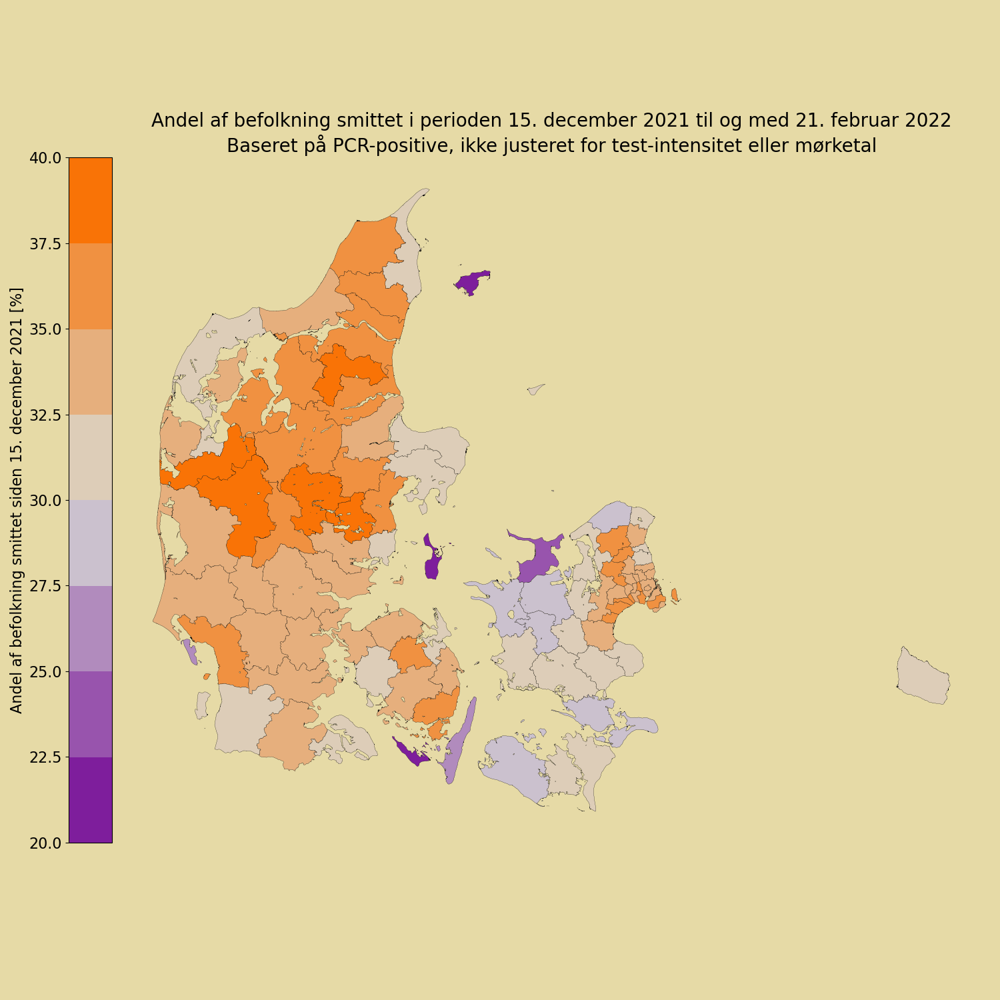
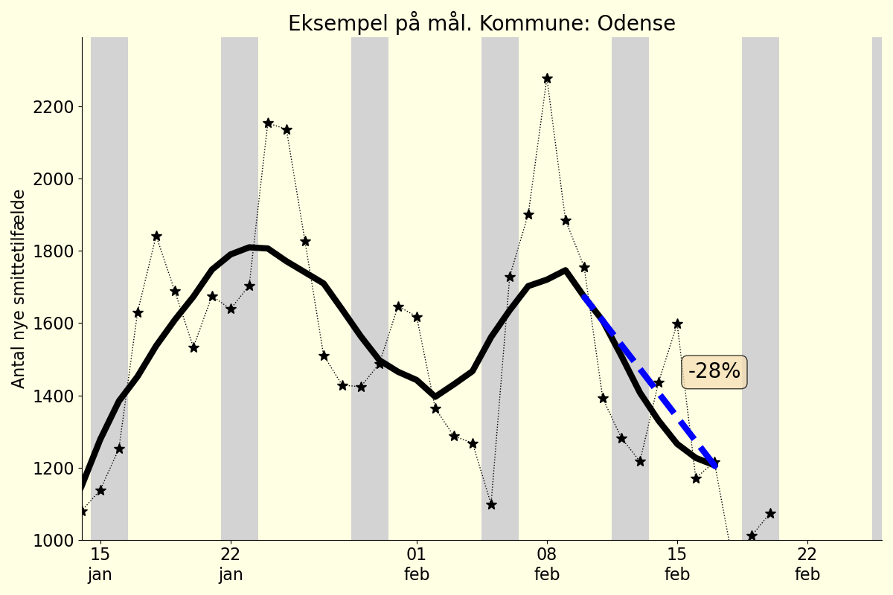
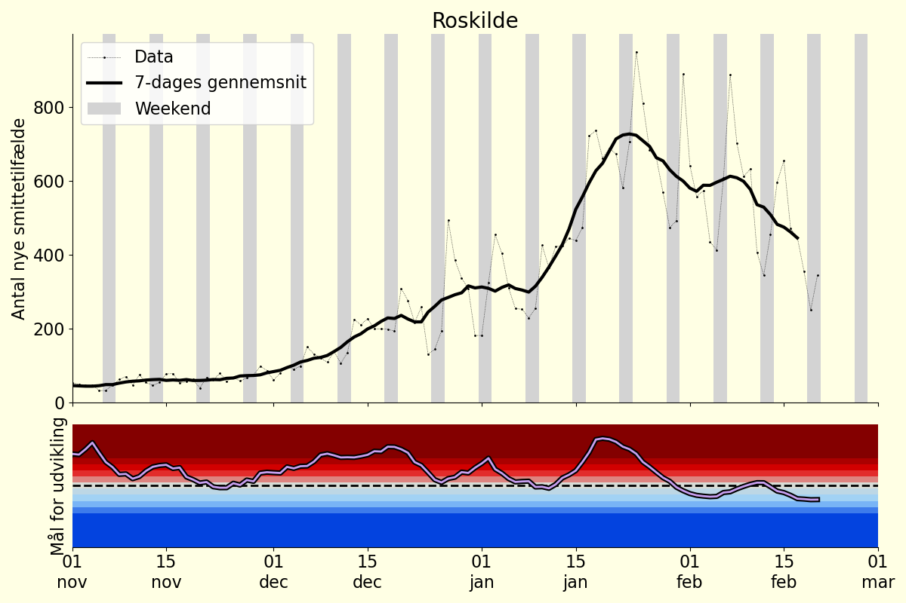
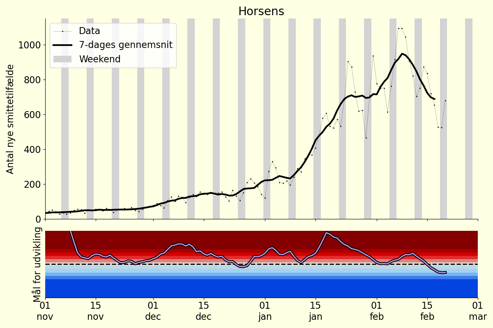

# Beskrivelse af figurer

## Kumuleret smitte i aldersgrupper

Sum af smittetilfælde siden 15. december 2021, fordelt på aldersgrupper. 
Da data er opgivet som en kumuleret sum, beregnes dette ved at fratrække værdien der gives for 15. december.

Data fra '/Kommunalt_DB/17_tilfaelde_fnkt_alder_kommuner.csv'. Da filen kun indeholder seneste værdi gennemløbes alle dashboardfilsamlinger der indeholder denne data (fra 2021-09-22 og frem). Befolkningstal på nationalt niveau fordelt på aldersgrupper baseret på data for 2021 fra Danmark Statistik.

## Kort over naturlig immunitet

Summen af smittetilfælde beregnes, fra 15. december til og med to dage før den dag data er fra. 

(På denne måde udelades data fra nuværende dag og dagen før, da disse typisk ikke er færdigopgjort på data-udgivelsestidspunkt. Selvom manglende opgørelser ikke er et problem for denne figur, udelades de to dages data stadig, for at være konsistent med andre figurer)

Summen af smittetilfælde divideres med befolkningstallet i den givne kommune, og resultatet vises.
Bemærk at farveskalaen skæres af i enderne, således at alle værdier under 10% farves som 10%, og tilsvarende med den maksimale værdi.

Data fra dashboard-fil: '/Kommunalt_DB/07_bekraeftede_tilfaelde_pr_dag_pr_kommune.csv' samt befolkningstal fra '/Kommunalt_DB/10_Kommune_kort.csv'

Data er, så vidt vides, opgjort på opgørelsesdato. (I skrivende stund er der en fejl i readme-filens beskrivelse af fil "07", så det ikke er klart)

# Smitteudvikling
## Kort over smitteudvikling

Smitteudviklingen i den seneste 7-dages periode beregnes for hver kommune for sig. 
Der redegøres for metoden længere nede.

Ydergrænserne af farveskalaen dækker over en konsistent stigning på 50% sammenlignet med ugen før, og tilsvarende et fald på 50% for bunden af skalaerne. 
Bemærk at farveskalaen skæres af i enderne så større stigninger (hhv fald) vises som samme farve som "Stor stigning" (hhv "Stort fald"). 
Altså fra 50% stigning og højere vises således med samme farve. Dette gøres for at fremhæve små fald.

Data fra dashboard-fil: '/Kommunalt_DB/07_bekraeftede_tilfaelde_pr_dag_pr_kommune.csv'

### Metode for beregning af mål
Der er betydelige forskelle i testmønster afhængigt af ugedag. Én måde at undgå disse variationer er at se på et løbende gennemsnit med en bredde af 7 (eller et multiplum af 7).
Alternativt kan antallet af nye smittetilfælde en given dag sammenlignes direkte med antallet af nye smittetilfælde på samme ugedag ugen før. 

Vi beregner den relative ændring i nye smittetilfælde for de seneste 7 datapunkter. 

Summen af de 7 relative ændringer beregnes, og benyttes til farvekodning i figuren. 
I praksis divideres summen med 7, og målet er således den gennemsnitlige relative ændring for de syv dage.
Ydergrænserne af farvesprektet er sat sådan at farverne går fra mørkeblå i -0.5 (dvs -50%) over lys-grå i 0 til mørkerød i +0.5 (dvs +50%). Værdier over 0.5 farves som 0.5, og værdier under -0.5 farver som -0.5.

### Eksempler på smitteudviklingsmål over tid
Herunder gives eksempler på det beskrevne smitteudviklingsmål over tid for udvalgte byer.
Øverste panel i figurerne viser nye smittetilfælde for hver dag, med et 7-dages gennemsnit.
Nederst i figuerne vises udviklingen af smitteudviklingsmålet. (Y-aksens skala går fra -1 til 1 for at illustrere hvordan værdi udenfor intervallet mellem -0.5 og 0.5 farves)

