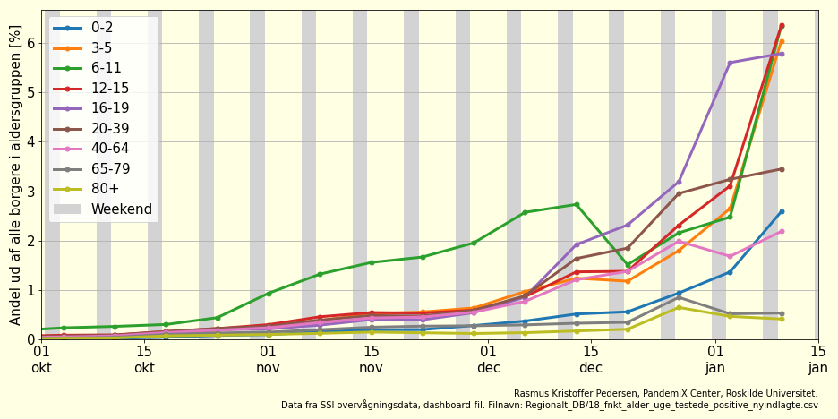
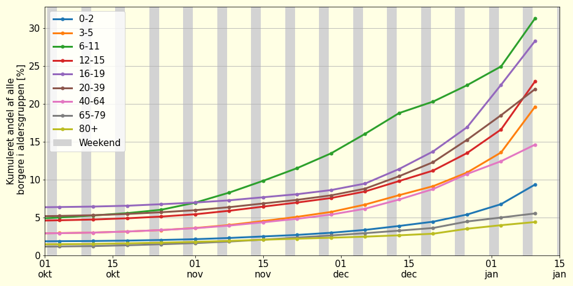

# Overblik over aldersfordeling 

---

## Antal smittetilfælde
### Hver for sig

### Relativt til størrelsen af befolkningsgruppen

### Relativt til størrelsen af befolkningsgruppen, kumuleret

### Stacked

--- 

## Nyindlagte, per 100.000 borgere i aldersgruppen

---

## Antal testede
### Hver for sig

### Stacked

