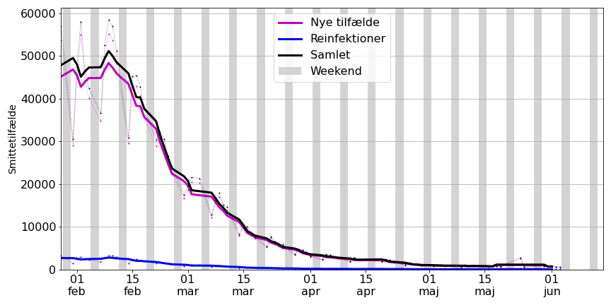
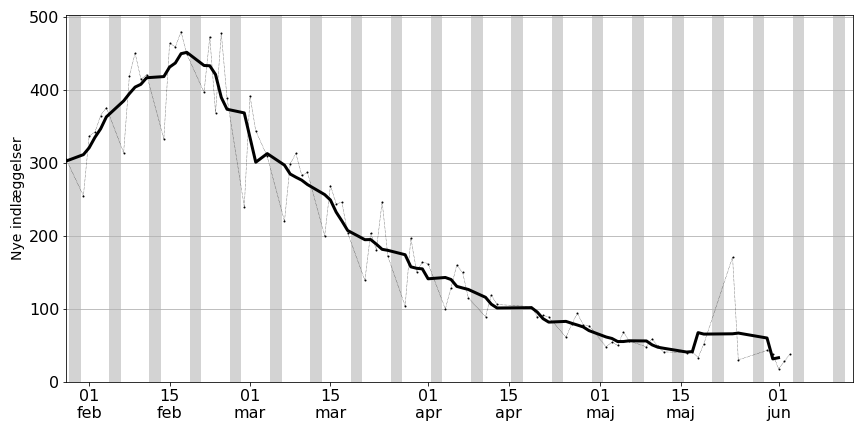
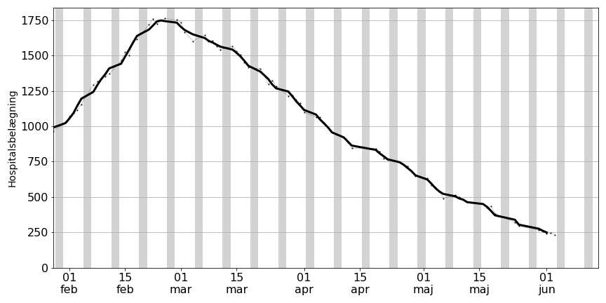
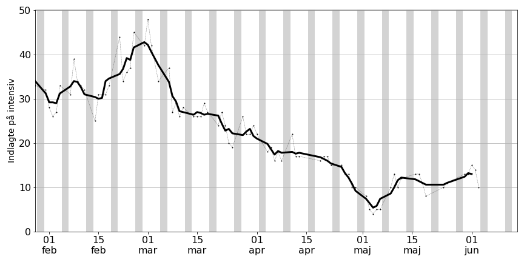
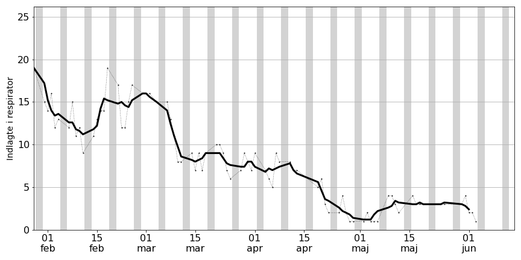
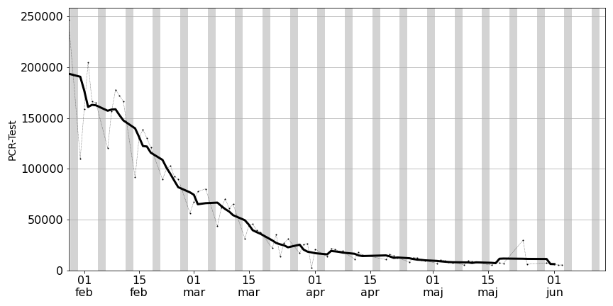
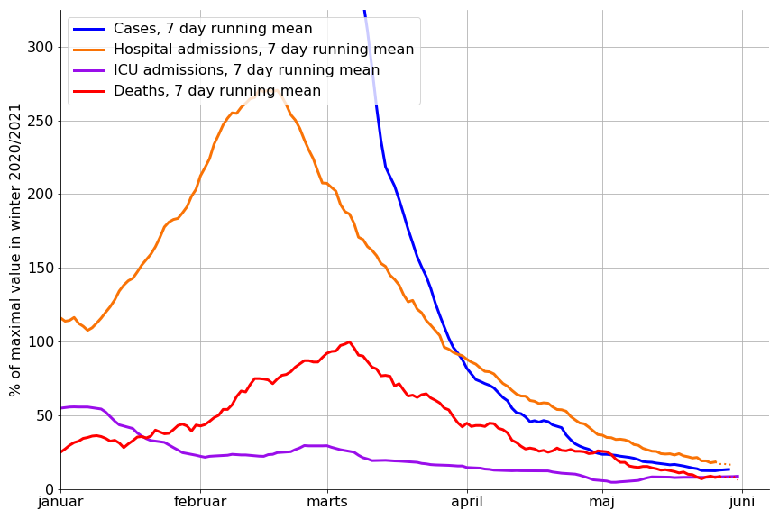

# Overblik over COVID-19 i foråret 2022

## Antal smittetilfælde

Tilfælde er baseret på positive COVID-19 PCR-test. 

Data på figuren er vist ud fra den dag prøven er taget. Af denne grund er data for den seneste dato udeladt.

## Nyindlagte

## Hospitalsbelægning
### Samlet

### Intensiv

### Respirator

### Tests

<!-- 
Intensiv | Respirator
:-------------------------:|:-------------------------:
 |   -->

## Dødsfald

## Sammenligning med maksimal værdi 

Forklaring: 

Antallet af smittetilfælde (blå) og antallet af nyindlæggelser er normeret sådan at det maksimale antal i vinteren 2020/2021 er 100%. Værdien for 7-dages gennemsnit er benyttet. 

Når smittetilfælde viser 1000% vil det altså sige at der er 10 gange så mange tilfælde som sidste år. Indlæggelsesraten per fundne smittetilfælde ses at være betydeligt lavere.
